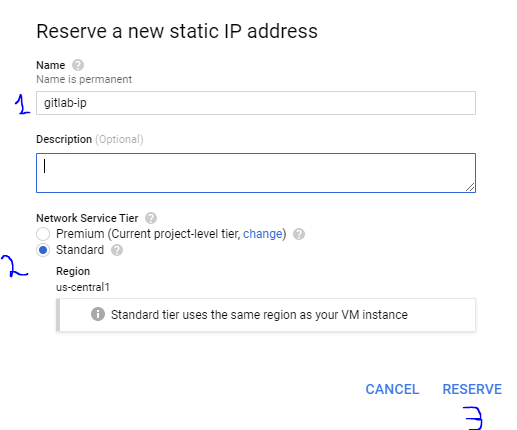
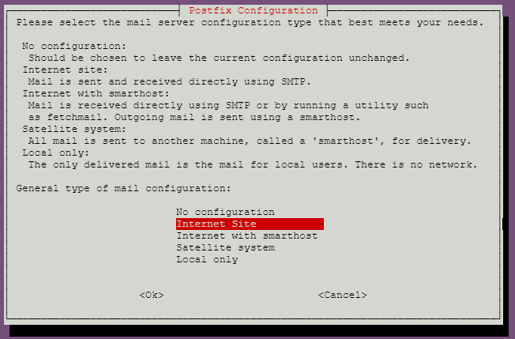

# GitLab GCP Installation Tutorial 

This tutorial is based on how the GCP dashboard looked like on October 2020

## Table of content

[TOC]


## Create project 

### Creation 

Go to projects by 

Menu -> <button>Home</button>


And click the project dropdown 


In the popup, select <button>NEW PROJECT</button> 


Choose a name for your project, 

For location, leave it as No organization 

and press <button>CREATE</button>


Wait until project is created, and make sure you are within the project scope by checking 


### Billing

By default, the class credit billing account would be selected for your project. However, to make sure, 

From left side menu,  click <button>Billing</button>


 


And, make sure that the proper billing account linked to the project:


## Create VM

From left side menu, 

Select <button>Compute Engine</button>


Select <button>Create</button> to create a new VM:


### Configurations 


1- For the instance **Name**, choose a proper name, for example `gitlab-instance`

 2- For **Machine configuration**; make sure to select the following

| configuration  |              Value              |
| :------------: | :-----------------------------: |
| Machine family |         General Purpose         |
|     Series     |               E2                |
|  Machine type  | e2-medium (2 vCPU, 4 GB memory) |


For the boot disk: 

Change it to *Ubuntu 20.04 LTS*

For this, click the <button>Change</button> under boot disk: 


Select following configurations and click <button>Select</button>


Under firewall, make sure to have both 

*Allow HTTP traffic* 

*Allow HTTPS traffic*

is selected! 

<div style="background-color:#fbff8a; padding:20px; border: 1px solid red;">
    <center><strong>Warning!</strong></center><br>
    <ul>
        <li>Not allowing HTTP/HTTPS traffic will prevent access to the gitlab server, or any server! Make sure you have them checked! </li>
    </ul> 
</div>


Re-check the settings and make sure the proper options are selected.

<center>Configuration summary</center>

|      configuration      |                   Value                    |
| :---------------------: | :----------------------------------------: |
|          name           | As you pleased ( gitlab-instance for best) |
|       Region/Zone       |      us-central1(Iowa)/us-central1-a       |
|     Machine family      |              General Purpose               |
|         Series          |                     E2                     |
|      Machine type       |      e2-medium (2 vCPU, 4 GB memory)       |
|           OS            |                   Ubuntu                   |
|       OS version        |                 20.04 LTS                  |
| Identity and API access |            Allow default access            |
|        Firewall         |            ALLOW HTTP and HTTPS            |

Then click <button>Create</button> to create your VM.

## Install GitLab

### Configure static IP

GCP assigns a dynamic IP to VM by default. This will cases changes the address of GitLab server when ever server shuts down. This case problems for the GitLab installation. To prevent this, we can assign an static IP to the VM. 

In order to do that, in the left menu, 

Under <button>Compute Engine</button> , select <button>VM Instances</button>


Here, you find the list of your VMs, which at least one them should be your newly created GitLab-instance. 

Click on the instance name: 


And press <button>EDIT</button>


Click to edit **Network interfaces**


Find **External IP** option and click the drop box and select *Create IP address*

In the pop-up, assign a name, select **Standard** for service tier and click <button>RESERVE</button>



Click <button>Done</button> for Network interfaces:


And click <button>Save</button> on the bottom of page to save configuration. 


### Connect to your newly created VM by SSH

Return back to VM instances page 

To connect, click <button>SSH</button> to connect to VM: 


A new pop-up window with a **shell** will appear. **Remember you IP address!** 

### Update and Upgrade your system 

Type following in the shell: 

```shell
sudo apt-get update 
sudo apt-get upgrade -y
```

### Install GitLab 

The official instructions also can found [here](https://about.gitlab.com/install/#ubuntu).

##### Install and configure the necessary dependencies

Type following in the shell: 

```shell
sudo apt-get install -y curl openssh-server ca-certificates tzdata
```

##### Install postfix for email : 

Type following in the shell: 

```shell
sudo apt-get install -y postfix
```


During Postfix installation a configuration screen may appear. Select 'Internet Site' and press enter. Use your server's external DNS for 'mail name' and press enter. If additional screens appear, continue to press enter to accept the defaults.




##### Add the GitLab package repository and install the package

Type following in the shell: 

```shell
curl https://packages.gitlab.com/install/repositories/gitlab/gitlab-ee/script.deb.sh | sudo bash
```


##### Install GitLab 

Type following in the shell and replace the {your-ip-address} with you IP address which is visible on VM instances row. 

```she
sudo EXTERNAL_URL="https://{your-ip-address}" apt-get install gitlab-ee
```

Wait until installation is over.  This will take 10 minute or more. 

After the installation is done, 

Type following in the shell 

```shell
sudo gitlab-ctl start 
```

now, you can access your GitLab Server using a browser, 

## Configure GitLab and create an reop 

In the VM instances page, click on your instance IP 


In a new tab, the GitLab page should appear, 

**Notice 1:** You might face with browser safety alert that the page is not secure, that is because we are using an IP instead of domain in a HTTPS connection, depending on your browser, accept to enter to webpage. 

**Notice 2: ** GitLab takes a few minute to configure initially and you might see a error 502 *Whoops, GitLab is taking too much time to respond.* Wait 5 minutes and refresh the page again until you see the following page   


Enter a new password for your root access. 

Then in a sign in page, type `root` as the username and the password you just assigned: 


After you logged in, you should see following page: 


**Congratulations**, you just installed GitLab on GCP. 

You can create a new Project (same as repository in GitHub) and use it similarly. 


## Shutdown the server 

To minimize the costs and keep your free GCP credit for long time, remember to shutdown your VM when you are not using it. To do that, 

Go to VM Instances page, select the VM by checking the check box on its left, and press stop button from top menu. 

 

 

You can restart the VM by pressing the PLAY button. 

**Note** that every time server starts up, it takes some time to load up and you might again see the **error 502**. Just give it a 5~10 minutes and refresh it. 

